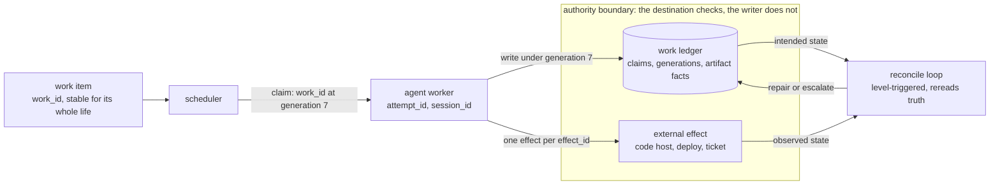

# software-factory-reliability

Coding agents fail in ways that look strange until you treat the software
factory around them as a distributed system. Then the strangeness resolves
into a short list of familiar failures: stale workers, duplicate effects, lost
work, false completion, retry storms, and publication nobody can verify.

This repository is the executable companion to
[Software Factories Are Distributed Systems](https://www.sjarmak.ai/writing/software-factories-are-distributed-systems).
It holds small examples and fault-injection drills for the failure modes the
essay describes, plus a checker that reads a description of your factory and
tells you which of those boundaries you have left open.

Want to see the core problem? Run this:

```bash
git clone https://github.com/sjarmak/software-factory-reliability
cd software-factory-reliability
make demo
```

## See a software factory fail in five minutes

`make demo` builds two factories that differ in exactly one place: where the
ownership fence is checked. It runs the same fault against both, and narrates
the two event logs the runs actually produced.

```
One work item, one lease expiry, two factories. The factories differ in
exactly one place: where the ownership fence is checked.

UNSAFE  (fence checked by the writer, then an unconditional write)
  generation 7 holds the claim and has prepared artifact-g7
  generation 7 loses ownership
  generation 8 becomes current
  generation 8 writes artifact-g8
  generation 8 records the work complete
  generation 7 writes artifact-g7 anyway
  destination applies it, nothing checks the generation
  generation 7 records the work complete
  destination holds artifact-g7                               FAIL

PROTECTED  (fence checked at the destination, atomically with the write)
  generation 7 holds the claim and has prepared artifact-g7
  generation 7 loses ownership
  generation 8 becomes current
  generation 8 publishes artifact-g8
  generation 8 records the work complete
  generation 7 attempts to publish artifact-g7
  destination rejects the stale writer, current is 8
  generation 7 attempts to record completion
  destination rejects the stale completion
  destination holds artifact-g8                               PASS
```

The unsafe factory lost generation 8's work and published a superseded
artifact under a completion record that says everything went fine. This is the
failure the essay describes in "Authority has to expire cleanly".

Nothing in that output is a canned transcript. Every line is rendered from an
event in `out/evidence/stale-writer-completes-{unsafe,protected}.json`, an
unrecognized event kind prints raw, and a run whose oracle verdict is not the
expected one fails the demo. Requirements are Python 3.10 or newer and
`pip install -r requirements-dev.txt`.

## The ideas from the essay, and where to watch each one break

| Essay idea | See it fail | Pattern |
| --- | --- | --- |
| The work outlives the worker | `make drill DRILL=worker-dies-agent-survives MODE=unsafe` | [Durable intent](patterns/durable-intent.md) |
| Authority has to expire cleanly | `make demo` | [Fenced authority](patterns/fenced-authority.md) |
| External effects need their own contract | `make drill DRILL=effect-commits-ack-is-lost MODE=unsafe` | [Effect identity](patterns/effect-identity.md) |
| Events make it fast, reconciliation makes it true | `make drill DRILL=event-is-lost MODE=unsafe` | [Reconciliation](patterns/reconciliation.md) |
| Recovery is a measurement | `make drill DRILL=state-changes-check-does-not MODE=unsafe` | [Falsifiable checks](patterns/falsifiable-checks.md) |
| Capacity policy sits above the queues | [`drills/retry-storm/`](drills/retry-storm/DRILL.md) (specification) | [Topology-aware scheduling](patterns/topology-aware-scheduling.md) |
| "Done" has to mean something | [`drills/artifact-changes-after-verification/`](drills/artifact-changes-after-verification/DRILL.md) (specification) | [Verify before publish](patterns/verify-before-publish.md) |

Every `MODE=unsafe` command above is expected to exit 2. An unsafe control
that passes means the fault never reached the boundary, which makes it a
broken test rather than a safe system. Swap in `MODE=protected` and the same
drill exits 0.

## The shape of the thing



Everything inside the boundary evaluates the generation atomically with the
write. A worker that lost its claim still holds credentials and still believes
it is current, so the thing that reliably stops it is a destination that
refuses. The full authority-plane, identity, and campaign diagrams render in
[`docs/diagrams/`](docs/diagrams/README.md).

## Three ways to use this

**Five minutes: break a factory.** Run `make demo`, then run one drill in both
modes and diff the two evidence files. The drill directory holds the fault
placement, the oracle, and what the evidence must contain.

```bash
make drill DRILL=effect-commits-ack-is-lost MODE=unsafe     # exits 2
make drill DRILL=effect-commits-ack-is-lost MODE=protected  # exits 0
diff out/evidence/effect-commits-ack-is-lost-{unsafe,protected}.json
```

**Fifteen minutes: read the five patterns that carry the rest.** Each pattern
page opens with a compact box (problem, rule, required property, the wrong
shape, the right shape) and then goes deep: the invariant, the enforcement
boundary, the falsifying test, and the evidence retained.

1. [Stable work identity](patterns/stable-work-identity.md): one logical item, one id, for life.
2. [Fenced authority](patterns/fenced-authority.md): ownership is not authority.
3. [Effect identity](patterns/effect-identity.md): unbounded attempts, one physical effect.
4. [Verify before publish](patterns/verify-before-publish.md): the verdict binds to an immutable artifact.
5. [Reconciliation](patterns/reconciliation.md): every event path has a level-triggered twin.

The other eleven pages are indexed in [`patterns/`](patterns/README.md).

**Use it on your own factory.** Read the installation first, then decide. The
scaffold finds the effects your factory performs on something outside itself
and writes a probe pack naming them and the files they were found in; the
derivation reports, per effect, whether the call sites carry anything a
destination could use to tell a repeat from a new request.

```bash
python3 src/factory_check.py probes-init /path/to/your/factory --write probes.yaml
python3 src/factory_check.py infer       /path/to/your/factory --probes probes.yaml
python3 src/factory_check.py review      out/factory.derived.yaml
```

Every identity comes back `unknown` on the first pass, with the reason on the
line above it, because a scaffolded pack declares none and no scan of your code
can establish what your destination does with a repeat. Deciding those is the
part that needs you, and the scaffold offers the flags it saw at the call sites
as candidates rather than applying any of them.

That order matters. `init` writes a blank contract, and a blank contract can be
edited to a decided value while the factory stays exactly as it was -- findings
go green and nothing is fixed. Write one when you want to state the intent
independently, then hold the two against each other:

```bash
python3 src/factory_check.py init factory.yaml
python3 src/factory_check.py reconcile factory.yaml /path/to/your/factory --probes probes.yaml
```

Reconcile reports DRIFT where the contract claims an identity the call sites do
not carry, and UNDECLARED for an effect your factory performs and your contract
never mentions. DRIFT is what a contract edited ahead of the code looks like:
editing the claim back down turns it into OPEN, an undecided boundary, and only
the call sites can turn it into CONFIRMED.

[QUICKSTART.md](QUICKSTART.md) walks the full first session under an hour, and
[`docs/contract-reference.md`](docs/contract-reference.md) documents every
section and all twenty-three rules.

## What is in here

| Path | Contents |
| --- | --- |
| [`patterns/`](patterns/README.md) | sixteen failure boundaries, each with an invariant, an enforcement point, and a falsifying test |
| [`drills/`](drills/README.md) | thirteen fault drills; nine run against the in-memory simulator, four are specifications |
| [`examples/`](examples/README.md) | four worked factories, and one plausible-looking contract with six defects in it |
| [`evidence/`](evidence/case-studies/) | reproducible case-study bundles you can rerun and diff, plus the per-claim evidence map |
| [`schemas/`](schemas/) | JSON Schemas for contracts, campaigns, guarantees, and work manifests |
| [`docs/`](docs/design.md) | design, evidence methodology, contract reference, recipes, observability conventions |

Start with [`examples/README.md`](examples/README.md) if you would rather find
the defects yourself before the checker names them.

## Going deeper

- [docs/design.md](docs/design.md): the premise, why work identity and
  authority move in opposite directions, and how the pieces fit.
- [docs/evidence-methodology.md](docs/evidence-methodology.md): what declared,
  enforced, and fault-tested mean; the four basis labels; and why this kit
  computes no maturity score.
- [docs/contract-reference.md](docs/contract-reference.md): every contract
  section and every rule the review can emit.
- [docs/recipes/](docs/recipes/): four factory shapes worked end to end, plus a
  recovery path for a factory that is already broken.
- [docs/observability/](docs/observability/): event conventions, latency
  expectations, sample events, and queries.

## Contributing

`make check` runs the schema checker, the prose checker, the test suite, and
all nine executable drills. Prose rules are in [docs/style.md](docs/style.md);
they are enforced, not advisory, and the em dash rule has no exemptions
anywhere in the repository. A new pattern page must name an invariant, an
enforcement boundary, a falsifying test, and the evidence retained. A new
drill must fail in unsafe mode.
