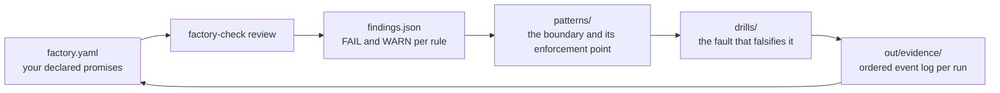

# Design

Why this kit exists, what it assumes about your factory, and how the pieces
fit together. Read [the README](../README.md) first if you have not run
`make demo` yet; this page is the layer underneath it.

## The premise

The workers are probabilistic; the factory still keeps its promises. A coding
agent can produce different output on identical input, misreport its own
progress, and keep writing after it has been replaced. None of that excuses
the factory from being deterministic about three things: which work exists,
who may write, and which effects happened. One production installation states
the constraint directly, "agents are nondeterministic; the factory must not
be", and rebuilds state from durable facts rather than an agent's memory on
every recovery (local observation,
gascity2026:docs/design/software-factory-philosophy.md).

Implementations vary; the failure boundaries recur. A controlled durability
lab ran the same crash placement (kill the worker after the external effect,
before the completion record) against four different integration layers: a
direct model CLI, a sandbox harness, a native agent loop, and a plain activity
retry. Every unsafe arm applied the external effect twice while the engine
recorded one completion; every protected arm applied it once (local
observation, temporallab2026:docs/guarantees.md). In production, two
independently written loops, a workflow-engine cycle and a shell poller,
showed the identical at-most-once-then-abandon shape on the same day,
2026-07-16 (local observation,
gascity2026:docs/design/durable-execution-walkthrough-pr-state-poller.md).
The boundaries belong to the problem; a different stack relocates them.

## Work identity survives executors; authority does not

These two properties move in opposite directions, and conflating them is
behind most duplicate-effect incidents in the evidence base.

A work item needs a stable logical identity that outlives any process, so that
a retry converges on the same work instead of forking it. In the lab, a stable
session key made two activity attempts converge on one external process after
a worker was killed (local observation,
temporallab2026:docs/findings/0001-worker-death-surviving-agent.md).

An executor's authority must do the opposite and die with its generation, so
that a stale writer cannot land effects after replacement. In the same lab,
unsafe systems accepted four obsolete generation-7 actions after generation 9
became current, and fenced systems accepted zero (local observation,
temporallab2026:docs/guarantees.md).

Four identities stay distinct in the contract schema, and collapsing any two
of them is a reviewable defect:

| Identity | Lifetime | Legitimate use |
| --- | --- | --- |
| `work_id` | the logical item, from creation to terminal disposition | join key for every durable record |
| `attempt_id` | one try | diagnostics, attribution, retry accounting |
| `session_id` | one executor process | attach-or-start decisions, cancellation |
| `generation` | one ownership epoch | the fence a destination compares against |

`IDENT-001` fails a contract that does not name the first three separately.
`IDENT-002` warns when an effect identity is derived from `attempt_id`, since
every retry then mints a new effect key and no destination can deduplicate.

## How the pieces fit

You describe your factory in a contract file. `factory-check review` flags the
recurring failure boundaries it can see in that description. The pattern pages
explain each boundary with its enforcement point. The drills inject the
corresponding fault against a simulated factory, so you can watch the unsafe
variant fail and the protected variant hold. Evidence from each drill run is
retained, because a guarantee you cannot show evidence for is a guess.

The loop is deliberate. A finding sends you to a pattern, the pattern names a
drill, the drill produces evidence, and the evidence is what upgrades a
guarantee's state in the contract. Nothing in the kit lets a promise advance
from declared to fault-tested without an executed run behind it.

## Implementation philosophy

**Enforcement lives at the destination.** A check the caller runs before its
own write is a time-of-check to time-of-use race with the reclaim it is
supposed to stop. Every rule in the catalog that accepts an enforcement point
accepts only `publisher`, `destination`, or `store`, and every fence operation
must be `compare-and-set` or `transactional`. `make demo` is the executable
form of this single distinction.

**Absence is a finding, not a pass.** `factory-check init` writes `unknown`
into the fields it cannot decide for you, and `review` reads both `unknown`
and a missing section as an explicit finding. A contract that says nothing
about its unknown-state policy has not chosen safety by default; it has
deferred the decision to whoever is on call when the ambiguity happens.

**An unsafe control that passes is a broken test.** Each executable drill runs
in two modes against the same simulator. The unsafe mode must violate the
oracle (exit 2) and the protected mode must pass (exit 0). A drill whose
unsafe arm passes is measuring nothing, and `make drills` treats that as a
failure of the drill rather than a property of the system.

**The tool refuses to score.** There is no aggregate maturity number, no
percentage, and no letter grade. The reasoning is in
[evidence-methodology.md](evidence-methodology.md#why-there-is-no-aggregate-score).

**Stack neutrality is a constraint on the vocabulary, not a claim of
portability.** The contract schema names promises and boundaries, never
products. A durable workflow engine, a queue plus a database, and a cron job
over flat files can all satisfy the same contract, and they relocate the
boundaries rather than removing them. Naming a system inside an evidence
citation is fine; recommending one is not.

**No Python packaging step.** Every entry point runs from a clean checkout
with `python3 <path>` and no `PYTHONPATH`, no virtualenv activation, and no
`pip install -e .`. Scripts under `src/` bootstrap their own import root. The
only third-party requirements are `pyyaml`, `jsonschema`, and `pytest`
(`requirements-dev.txt`).

## Repo map

| Path | Contents |
| --- | --- |
| `README.md` | the five-minute path: what fails, and where to watch it |
| `QUICKSTART.md` | the adopt path: describe your own factory and review it |
| `patterns/` | sixteen pattern pages, one per recurring failure boundary |
| `drills/` | thirteen fault-drill specifications; nine are executable |
| `examples/` | four worked factories, a deliberately unsafe contract, and the fixtures drills read |
| `evidence/` | reproducible case-study bundles, the per-claim evidence map, and sources |
| `schemas/` | JSON Schemas for contracts, campaigns, guarantees, and work manifests |
| `src/` | `factory_check.py`, the rule catalog, the renderer, `demo.py`, the adapters, the checkers |
| `docs/` | this page, evidence methodology, the contract reference, recipes, observability, diagrams, style |
| `tests/` | the suite for the CLI, the adapters, the drills, and the prose checker |

Inside `src/`, `adapters/protocol.schema.json` defines what a drill run must
emit, and `adapters/in_memory/` is the reference implementation that runs the
nine executable drills. A different adapter (a real workflow engine, your own
factory) satisfies the same protocol and reuses the same oracles.

## Recipes

Each recipe names the patterns a factory shape requires, the contract sections
that declare them, and the drills that test them.

- [issue-to-pull-request](recipes/issue-to-pull-request.md): one issue in, one
  verified pull request out.
- [background-maintenance](recipes/background-maintenance.md): recurring
  convergent housekeeping, and the case for a timer over an engine.
- [cross-repository-migration](recipes/cross-repository-migration.md): one
  change fanned across many repositories, joined by coverage.
- [human-approved-production-effect](recipes/human-approved-production-effect.md):
  an irreversible mutation gated on a named human decision.
- [factory-recovery](recipes/factory-recovery.md): the entry point when the
  factory is already broken. The other four assume you can describe your
  factory; this one recovers enough truth to write the contract in the first
  place.
