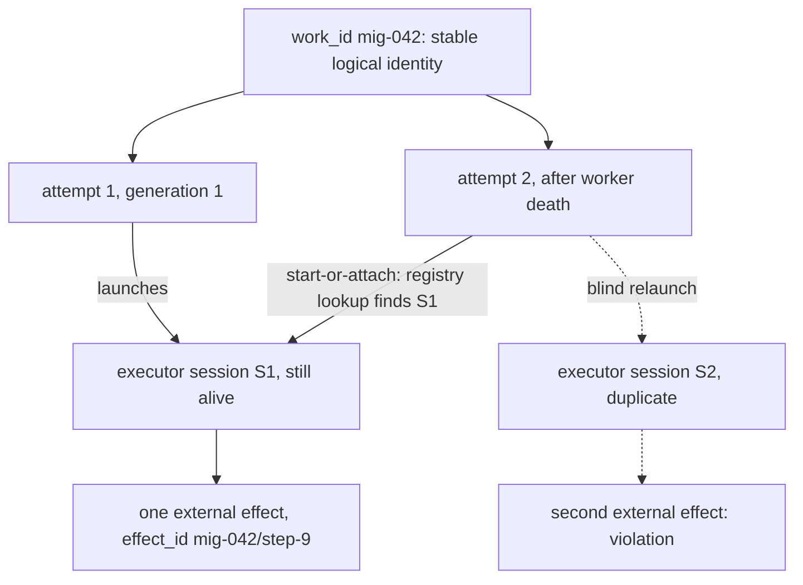
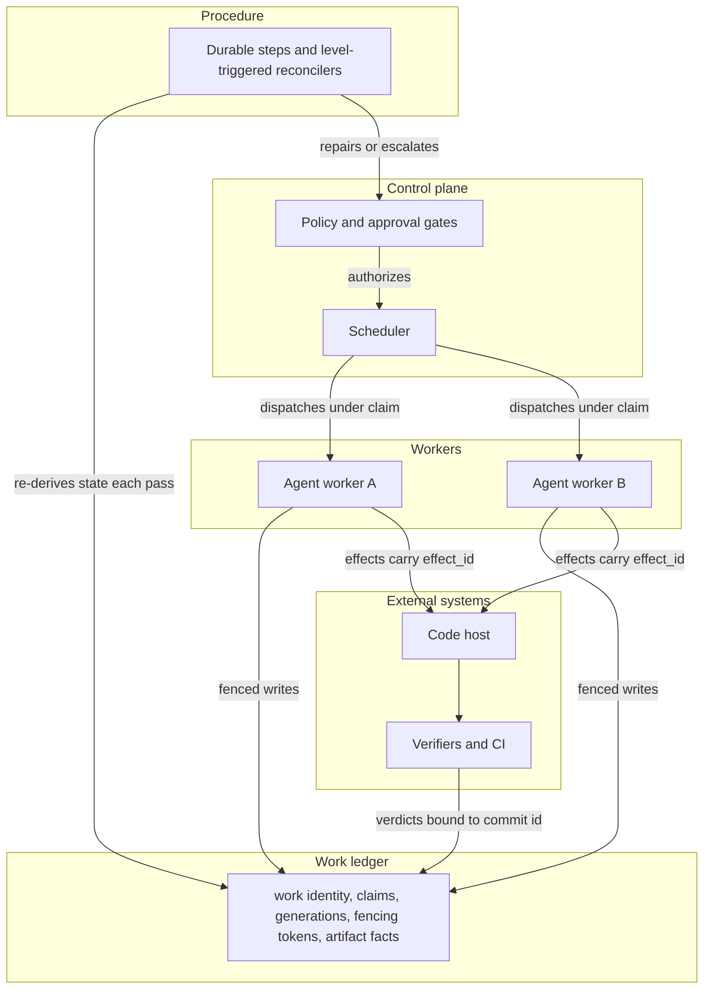
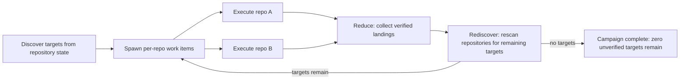

# Diagrams

Three views of the machine the [patterns](../../patterns/README.md) describe.
Each one renders below and has a `.mmd` source beside this page.

GitHub renders Mermaid inside fenced blocks in Markdown, and does not render a
standalone `.mmd` file, so clicking a source file shows text or a viewer error
rather than a diagram. This page is where they are readable. The fences here
are compared against the source files by `tests/test_diagrams.py`, which fails
if either copy drifts or a new source file arrives undocumented.

To render one yourself:

```bash
npx @mermaid-js/mermaid-cli -i docs/diagrams/identity-stack.mmd -o identity-stack.svg
```

## Identity stack

One work item, two attempts, and the point where a duplicate is born.
`work_id` is stable for the item's whole life; the attempt and the executor
session below it are not, and conflating them is what lets a second session
apply a second effect. The dotted path is the failure: attempt 2 relaunches
blind instead of resolving the session that is already running.
See [stable work identity](../../patterns/stable-work-identity.md) and
[start-or-attach](../../patterns/start-or-attach.md).



Source: [`identity-stack.mmd`](identity-stack.mmd)

## Authority planes

Which plane is allowed to decide what. Workers never write to the ledger
on their own authority; their writes carry a fencing token and the ledger
evaluates it. The reconciler re-derives state each pass rather than trusting
an event it received once, and escalates to the policy plane instead of
repairing past its remit.
See [fenced authority](../../patterns/fenced-authority.md) and
[reconciliation](../../patterns/reconciliation.md).



Source: [`authority-planes.mmd`](authority-planes.mmd)

## Campaign coverage loop

Why a campaign cannot finish by counting its children. Discovery runs
again after the reduce step, so targets that appeared after kickoff, or that a
task dropped silently, are still found. Completion is defined as zero
unverified targets remaining, not as every spawned task having returned.
See [cross-repo campaigns](../../patterns/cross-repo-campaigns.md) and
[fan-out fan-in](../../patterns/fan-out-fan-in.md).



Source: [`campaign-coverage-loop.mmd`](campaign-coverage-loop.mmd)
